<!-- ════════════════════════════════════════════════════ -->

<!-- Typing: shows role context only — body text won't repeat these -->

  

<!-- 3D isometric CPU chip animation -->

  

<samp>── ⟨ stack ⟩ ──</samp>

  
   
  

<samp>── ⟨ projects ⟩ ──</samp>

<table align="center">
<tr>
  <th align="left">Project</th>
  <th align="left">Tech</th>
  <th align="left">Description</th>
</tr>
<tr>
  <td>NASA Space Apps 2024</td>
  <td>—</td>
  <td>Exoplanet detection &amp; analysis — global hackathon</td>
</tr>
<tr>
  <td>FRC 610 Robot Code</td>
  <td><code>Java</code></td>
  <td>Advanced control algorithms &amp; sensor integration</td>
</tr>
<tr>
  <td>V5RC 16610V Robot Code</td>
  <td><code>C++</code></td>
  <td>Autonomous routines &amp; driver control</td>
</tr>
<tr>
  <td>Turret System Design</td>
  <td><code>CAD</code> <code>Java</code></td>
  <td>FRC 610 prototype — kinematics &amp; advanced control</td>
</tr>
</table>

<samp>── ⟨ stats ⟩ ──</samp>

  
  &nbsp;
  

  

  

  

<samp>── ⟨ contact ⟩ ──</samp>

  
  &nbsp;
  

  

