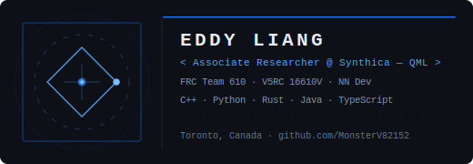

<!-- ═══════════════════════════════════════════════ -->
<!--   ANIMATED WAVE HEADER                        -->
<!-- ═══════════════════════════════════════════════ -->


<!-- ═══════════════════════════════════════════════ -->
<!--   TYPING ANIMATION                            -->
<!-- ═══════════════════════════════════════════════ -->
<p align="center">
  
</p>

<!-- ═══════════════════════════════════════════════ -->
<!--   3D ANIMATED BANNER                          -->
<!-- ═══════════════════════════════════════════════ -->
<p align="center">
  
</p>

<br/>

<!-- ═══════════════════════════════════════════════ -->
<!--   IDENTITY                                    -->
<!-- ═══════════════════════════════════════════════ -->

```
  ╔════════════════════════════════════╗
  ║  grade  ──  10                     ║
  ║  school ──  Crescent School        ║
  ║  loc    ──  Toronto, Canada        ║
  ╠════════════════════════════════════╣
  ║  » QML Researcher @ Synthica       ║
  ║  » FRC 610  ·  V5RC 16610V         ║
  ║  » NN Developer                    ║
  ╚════════════════════════════════════╝
```

**Active Roles**
- Associate Researcher @ **Synthica** — Quantum Machine Learning (QML)
- Robot Technician — **FRC Team 610** *(2025–2026)*
- Lead Programmer — **V5RC 16610V** *(2023–2026)*
- Neural Network Developer

**Competitive**
```
  CCC   ·   USACO [ Silver ]   ·   ACSL
```

<br/>

<!-- ═══════════════════════════════════════════════ -->
<!--   SKILL ICONS                                 -->
<!-- ═══════════════════════════════════════════════ -->
<h3 align="center">⟨ stack ⟩</h3>

<p align="center">
  
  <br/>
  
</p>

<br/>

<!-- ═══════════════════════════════════════════════ -->
<!--   GITHUB STATS                                -->
<!-- ═══════════════════════════════════════════════ -->
<h3 align="center">⟨ stats ⟩</h3>

<p align="center">
  
  &nbsp;
  
</p>

<p align="center">
  
</p>

<p align="center">
  
</p>

<p align="center">
  
</p>

<br/>

<!-- ═══════════════════════════════════════════════ -->
<!--   PROJECTS                                    -->
<!-- ═══════════════════════════════════════════════ -->
<h3 align="center">⟨ projects ⟩</h3>

<table align="center">
<tr>
  <th align="left">Project</th>
  <th align="left">Tech</th>
  <th align="left">Description</th>
</tr>
<tr>
  <td>NASA Space Apps 2024</td>
  <td>—</td>
  <td>Exoplanet detection &amp; analysis — global hackathon</td>
</tr>
<tr>
  <td>FRC 610 Robot Code</td>
  <td><code>Java</code></td>
  <td>Advanced control algorithms &amp; sensor integration</td>
</tr>
<tr>
  <td>V5RC 16610V Robot Code</td>
  <td><code>C++</code></td>
  <td>Autonomous routines &amp; driver control</td>
</tr>
<tr>
  <td>Turret System Design</td>
  <td><code>CAD</code> <code>Java</code></td>
  <td>FRC 610 prototype — kinematics &amp; advanced control</td>
</tr>
</table>

<br/>

<!-- ═══════════════════════════════════════════════ -->
<!--   CONTACT                                     -->
<!-- ═══════════════════════════════════════════════ -->
<h3 align="center">⟨ contact ⟩</h3>

<p align="center">
  <a href="https://github.com/MonsterV82152">
    
  </a>
  &nbsp;
  <a href="https://www.linkedin.com/in/eddy-liang-09893030b/">
    
  </a>
</p>

<p align="center">
  
</p>

<br/>

<!-- ═══════════════════════════════════════════════ -->
<!--   ANIMATED WAVE FOOTER                        -->
<!-- ═══════════════════════════════════════════════ -->

